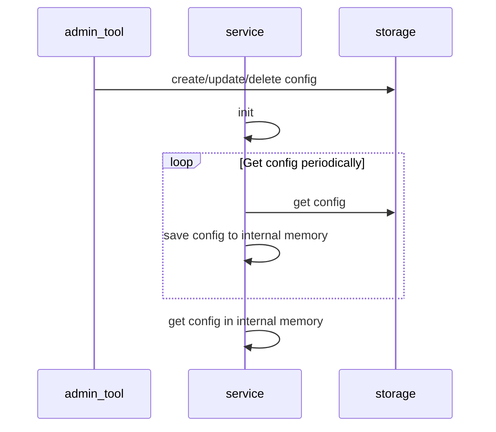

# Dynamic config

I choose Redis as config storage.

- Must have fallback value if can not get config from storage
- There is a small delay between updating config and service get the new config, because service update config
  periodically, not real time.
