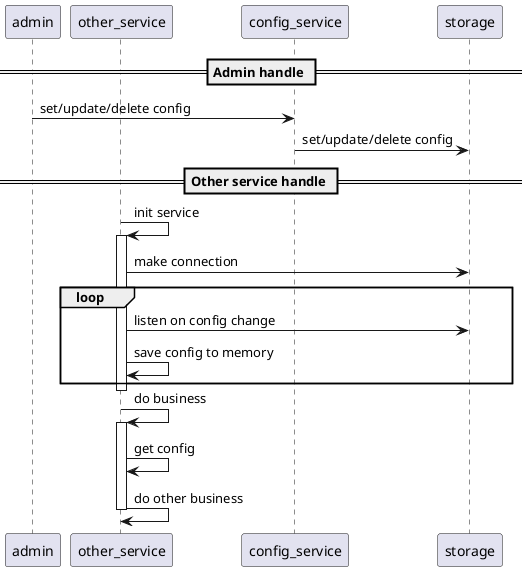

# Reload config

This serves as design draft of reload config system

Config storage can be any key value storage or database like etcd, Consul, mySQL, ...

If storage is key value storage, maybe there is API to listen on config change. Otherwise we should create a loop to get
all config from storage for some interval, for example each 5 minute.

Each `other_service` need to get config from its memory, not hit `storage`. So there is some delay between upstream
config (config in `storage`) and downstream config (config in `other_service`), but maybe we can forgive that delay
(???).

Pros:

- Config can be dynamic, service does not need to restart to apply new config.

- Each service only keep 1 connection to `storage` to listen to config change, not hit `storage` for each request.

Cons:

- Each service has 1 more dependency, aka `storage`.
- Need to handle fallback config, incase `storage` failure.
- Delay between upstream/downstream config
