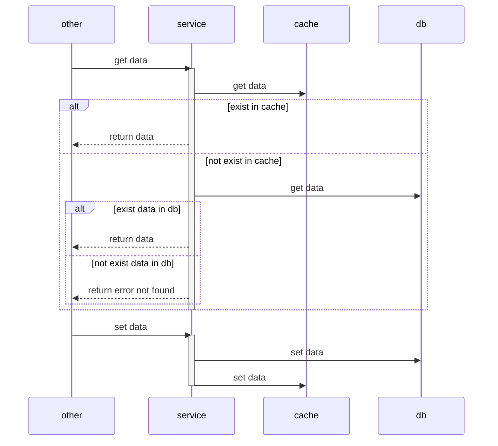

# Cache shenanigan

My notes/mistakes/... when using cache (mainly Redis) from time to time

My default strategy is:

- Write to database first then to cache second
- Read from cache first, if not found then read from database second, then re-write to cache

It's good for general cases, for example with CRUD action.

The bad things happen when cache and database are not consistent.
For example what happen if writing database OK then writing cache failed?
Now database has new value, but cache has old value
Then when we read again, we read cache first with old value, and that is disaster.

## Thanks

- [Cache Consistency with Database](https://danielw.cn/cache-consistency-with-database)
