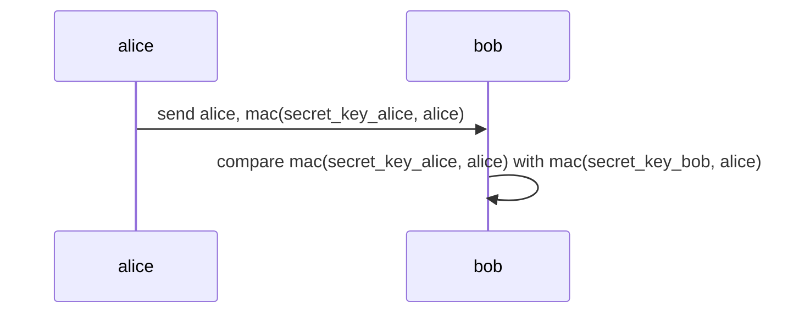
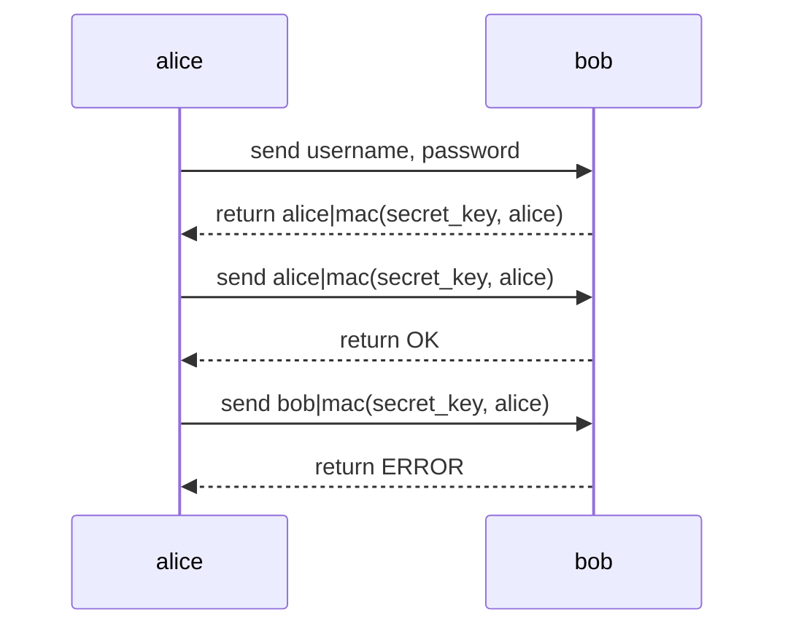
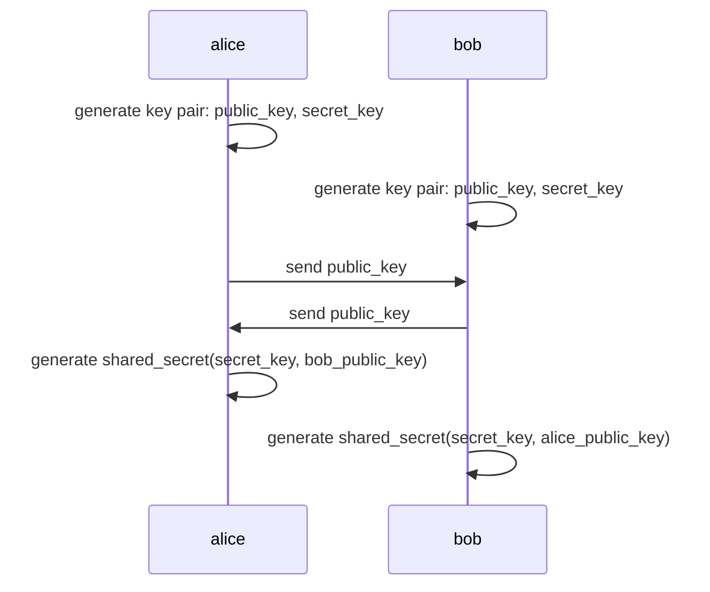

# Real World Crypto 101

My notes when reading
[Real-World Cryptography](https://www.manning.com/books/real-world-cryptography)

## **Hash** function

... convert from input to digest

- Pre-image resistance: Given digest, can not find input
- Second pre-image resistance: Given input, digest, can not find another input
  produce same digest. Small change to input make digest big change.
- Collision resistance: Can not find 2 input produce same digest.

## **MAC** aka Message Authentication Code

... produce from key, message to authentication tag.

- A send B message with MAC (generate from message and A key).
- B double check message with MAC (generate from receive message and B key).
- A and B use same key.



- Prevent forgery: without secret_key, can not generate MAC even if knowing **a
  lot of** alice and mac(secret_key, alice),
- Prevent collisions: keep MAC long enough (256-bit),
- Replay attacks: send transaction 2 times with perfectly MAC and u know why ->
  instead of mac(secret_key, alice), use **counter** as mac(secret_key, counter,
  alice).
- Verify must be done in **constant time**: if not, probably return error the
  moment the bytes differ -> attacker recreate byte by byte by measuring how
  long -> timing attacks

Constant time comparison:

```go
for i := 0; i < len(x); i++ {
    // Use XOR instead of compare x[i] == y[i]
    // If x[i] == y[i] -> XOR is 1
    // Otherwise XOR is 0
    v |= x[i] ^ y[i]
}

// v == 1 means all XOR is 1 means x == y
```

Use for:

- Integrity: because MAC ensure no one can tamper with message without noticing



**HMAC** is MAC using hash

## AES (Advanced Encryption Standard)

Currently (2023) the world using AES-128 which take a key 128 bits == 16 bytes

- Take a variable-length key
- Take plaintext of 128 bits
- Give ciphertext of 128 bits

AES is kind of cipher, handle fixed-size plaintext so we called **block
cipher**. AES is deterministic so we can encrypt and decrypt.

## AES-CBC (Cipher Block Chaining)

What if text you want to encrypt is longer than 128 bytes ? We add **padding**
for text to become multi block which has 128 bytes, then encrypt each block.

Adding padding bytes is easy, remove it after decrypt is hard. How do you know
which is padding bytes you add if you use random bytes ?

Just use **PKCS#7 padding**. Example AES-128 use block of 16 bytes but only have
9 bytes, should add 7 bytes padding. Just fill all padding bytes with padding
length aka value `07`.

```txt
XX XX XX XX XX XX XX XX XX 07 07 07 07 07 07 07
```

So to know how much padding bytes should we remove -> read last bytes (`07`) to
know the length to remove trailing padding bytes.

The problem with naive way to split text, add padding bytes then encrypt each
block using AES-128 is repeated text. Because it leaks information if text is
made up from many repeated text (See
[The ECB penguin](https://words.filippo.io/the-ecb-penguin/)).

CBC = deterministic block cipher + IV (initialization vector)

AES-CBC encrypt:

- IV XOR first plaintext -> AES encrypt -> first ciphertext.
- Use first ciphertext as IV to second ciphertext and so on.

AES-CBC decrypt:

- AES decrypt first ciphertext -> XOR IV -> first plaintext.
- Use first ciphertext as IV to second block and so on.

Because IV, same plaintext can encrypt to different ciphertext.

**WARNING** If IV become predictable, AES-CBC become deterministic -> BEAST
attack (Browser Exploit Against SSL/TLS).

## AEAD (Authenticated Encryption with Associated Data)

Because AES-CBC requires IV which shows public -> attacker can change IV -> lack
of authenticity -> use AES-CBC-HMAC or AEAD.

AEAD provides a way to authenticate **associated data**.

## AES-GCM (Galois/Counter Mode)

... is one of AEAD implementation.

AES-GCM = AES-CTR (Counter) + GMAC message authentication code

AES-CTR encrypt:

- Create nonce 12 bytes (same purpose as IV).
- Concatenate nonce with counter 4 bytes: 1, 2, 3, ...
- Encrypt AES from concatenated none with counter to **keystream**.
- XOR keystream with plaintext -> ciphertext.

Limit is counter only up to 4 bytes so only handle plaintext of 2^32 - 1 blocks
of 16 bytes aka 69 GBs.

AES-CTR no need padding because if keystream is longer than plaintext, it is
truncated to plaintext length before XOR.

This is stream cipher, differ from block cipher

- No need padding.
- Ciphertext is same length as plaintext.

GMAC is MAC with GHASH. GHASH resembles CBC mode.

## ChaCha20-Poly1305

... is one of AEAD implementation.

ChaCha20-Poly1305 = ChaCha20 stream cipher + Poly1305 MAC

## Key exchange



Prevent MITM (Man In The Middle) passive attack. If attacker can intercept
public_key then it's over.

## Diffie-Hellman

... is key exchange algorithm.

- Alice and Bob agree on prime number `p` and generator `g`.
- Alice generate secret `a` and public `A = g^a mod p`.
- Bob generate secret `b` and public `B = g^b mod p`.
- Alice and Bob exchange `A` and `B`
  - Same secret `A^b mod p == B^a mod p == g^(ab) mod p`

Diffie-Hellman is based on group theory.

## Elliptic Curve Diffie-Hellman (ECDH)

Instead of prime number, use elliptic curve.

- Alice and Bob agree on elliptic curve `E` and generator `G`.
- Alice generate secret `a` and public `A = [a]G`.
- Bob generate secret `b` and public `B = [b]G`.
- Alice and Bob exchange `A` and `B`
  - Same secret `[a]B == [b]A == [ab]G`

## Asymmetric encryption

Everyone use Alice's public key to encrypt email then send to Alice. Alice use
private key to decryt received emails.

In practice, asymmetric encryption can only encrypt messages up to a certain
length.

## Hybrid encryption
