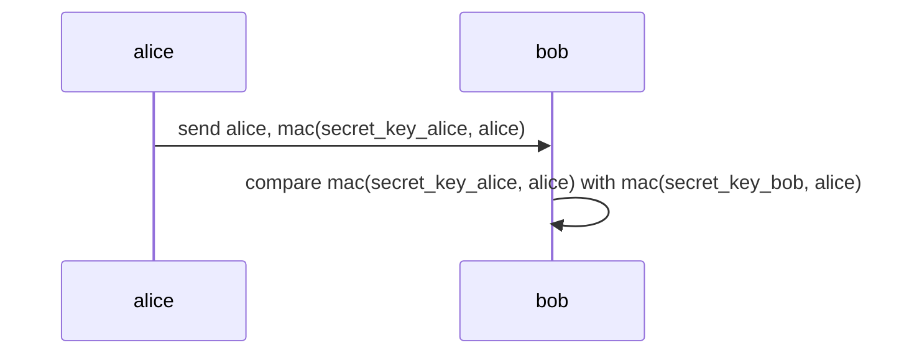
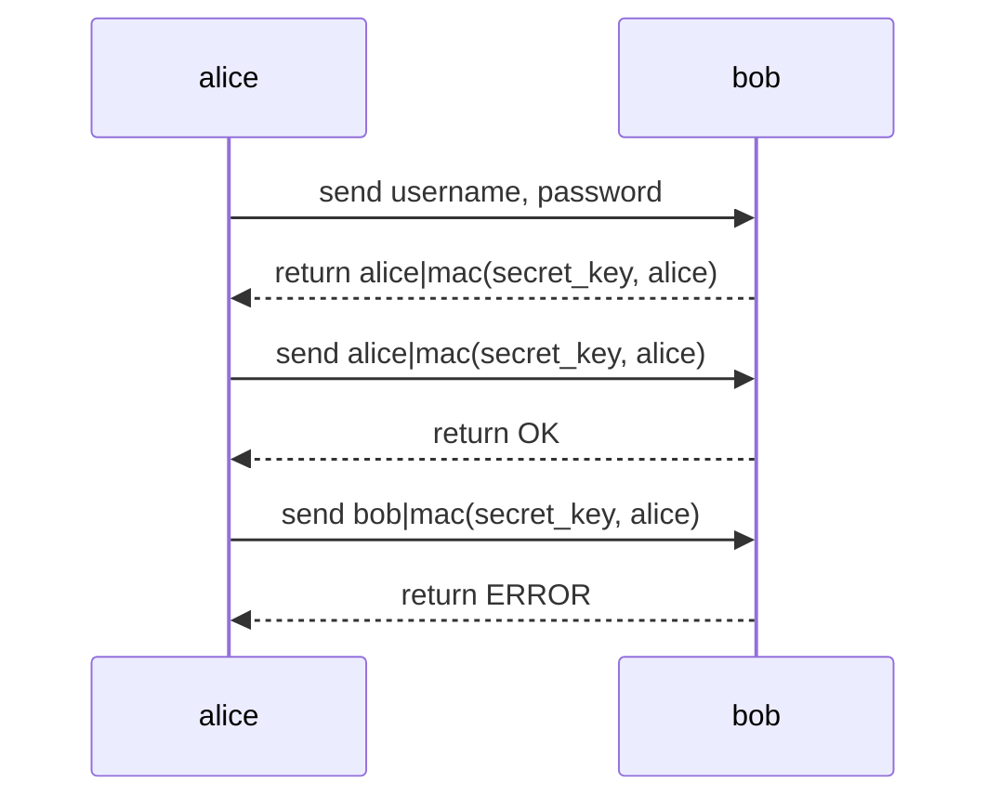

# Real World Crypto 101

My notes when reading
[Real-World Cryptography](https://www.manning.com/books/real-world-cryptography)

## **Hash** function convert from input to digest

- Pre-image resistance: Given digest, can not find input
- Second pre-image resistance: Given input, digest, can not find another input
  produce same digest. Small change to input make digest big change.
- Collision resistance: Can not find 2 input produce same digest.

## **MAC** aka Message Authentication Code produce from key, message to authentication tag.

- A send B message with MAC (generate from message and A key).
- B double check message with MAC (generate from receive message and B key).
- A and B use same key.



- Prevent forgery: without secret_key, can not generate MAC even if knowing **a
  lot of** alice and mac(secret_key, alice),
- Prevent collisions: keep MAC long enough (256-bit),
- Replay attacks: send transaction 2 times with perfectly MAC and u know why ->
  instead of mac(secret_key, alice), use **counter** as mac(secret_key, counter,
  alice).
- Verify must be done in **constant time**: if not, probaly return error the
  moment the bytes differ -> attacker recreate byte by byte by measuring how
  long -> timing attacks

Constant time comparision:

```go
for i := 0; i < len(x); i++ {
    // Use XOR instead of compare x[i] == y[i]
    // If x[i] == y[i] -> XOR is 1
    // Otherwise XOR is 0
    v |= x[i] ^ y[i]
}

// v == 1 means all XOR is 1 means x == y
```

Use for:

- Integrity: because MAC ensure no one can tamper with message without noticing



**HMAC** is MAC using hash
