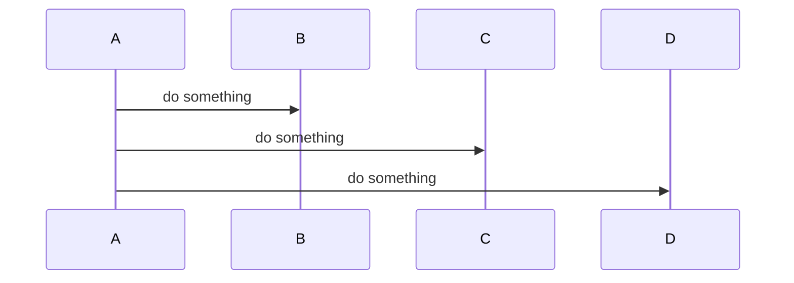
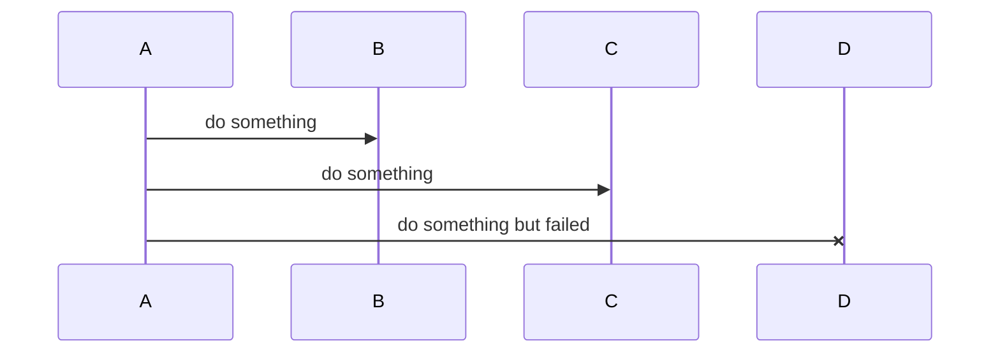
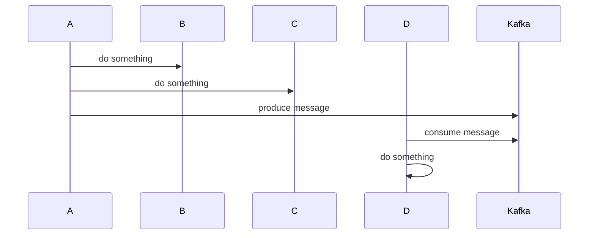
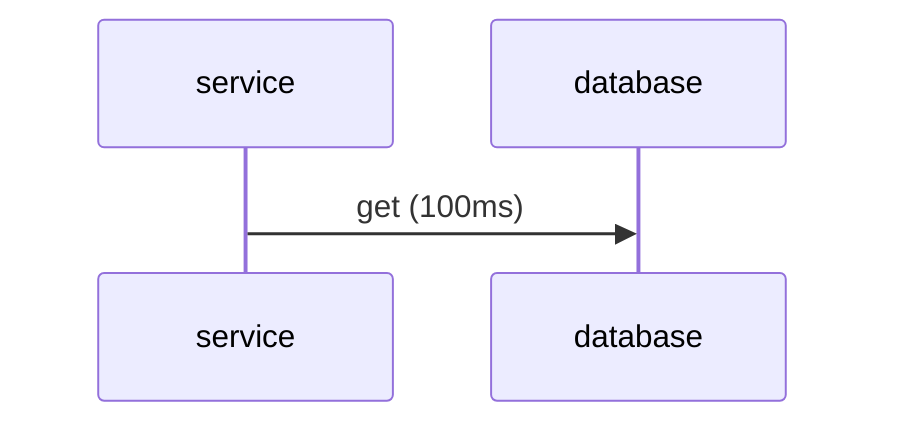
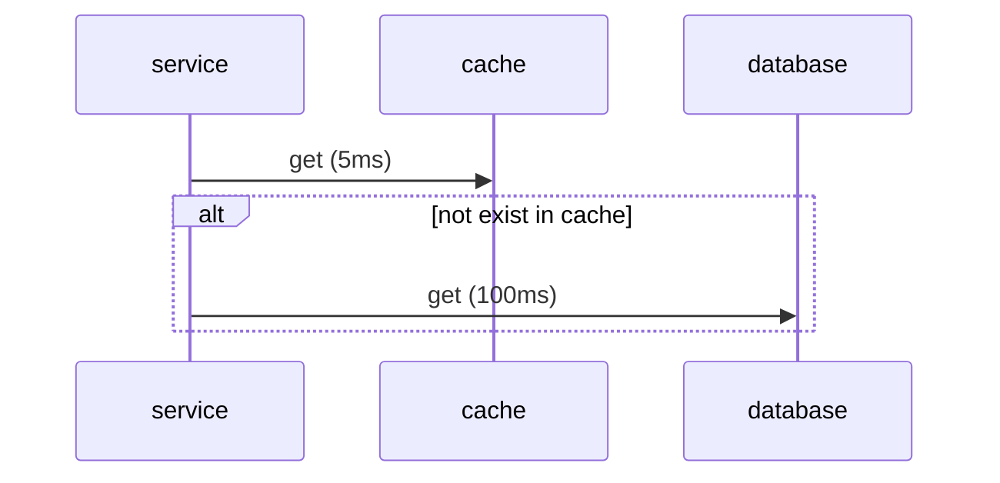
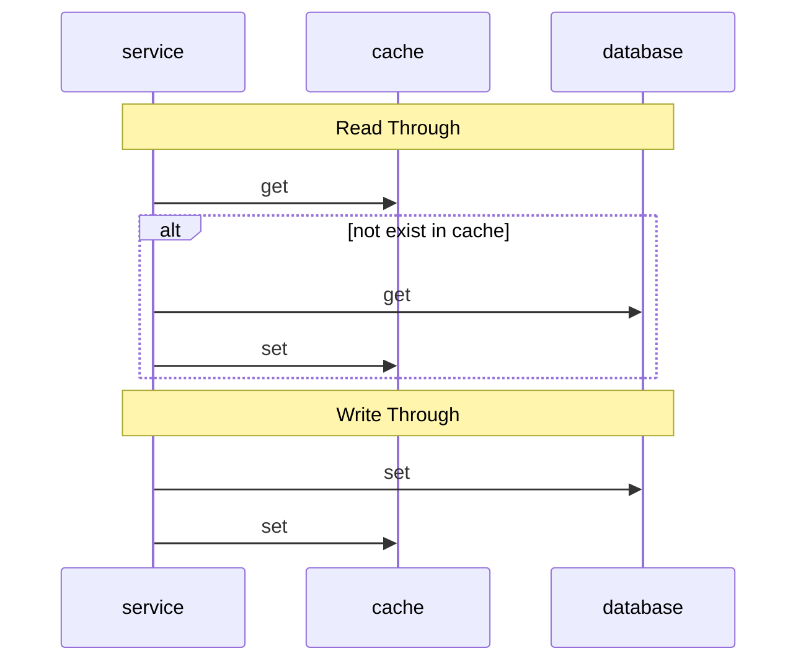

# Backend Thinking

## Backend Role

Transform business requirements to action, which usually involves:

- Service:
  - ZaloPay use microservices architecture, mostly written using Go and Java
- API:
  - HTTP (Client-Server) and GRPC (Server-Server)
- Database/Cache/Storage/Message Broker
  - MySQL/Redis/S3/Kafka
  - CRUD
- Docs
  - Mostly design notes and diagrams which show how to implement business
    requirements

After successfully do all of that, next step is:

- Testing
  - Unit tests, Integration tests
- Observation
  - Log
  - Metrics
  - Tracing

In ZaloPay, each team has its own responsibilities/domains, aka many different
services.

Ideally each team can choose custom backend techstack if they want, but mostly
boils down to Java or Go. Some teams use Python for scripting, data processing,
...

_Example_: Team UM (User Management) has 10+ Java services and 30+ Go services.

The question is for each new business requirements, what should we do:

- Create new services with new APIs?
- Add new APIs to existing services?
- Update existing APIs?
- Change configs?
- Don't do anything?

_Example_: Business requirements says: Must match/compare user EKYC data with
Bank data (name, dob, id, ...).

## Technical side

Backend services talk to Frontend, and talk to each other.

How do they communicate?

### API

**First** is through API, this is the direct way, you send a request then you
wait for response.

**HTTP**

- Use HTTP Method GET/POST/…
- HTTP responses status code
- ZaloPay rule
  - Only return code 200
  - Response body is only JSON

**GRPC**

- Use proto file as contract
- GRPC status code
  - OK
  - INVALID_ARGUMENT
  - INTERNAL …

There are no hard rules on how to design APIs, only some best practices, like
REST API, ...

Correct answer will always be: "It depends". Depends on:

- Your audience (android, ios, web client or another internal service)
- Your purpose (allow to do what?)
- Your current techstack (technology limitation?)
- Your team (bias, prefer, ...?)
- ...

Why do we use HTTP for Client-Server and GRPC for Server-Server?

- HTTP for Client-Server is pretty standard. Easy for client to debug, ...
- Before ZaloPay switch to GRPC for Server-Server, we use HTTP. The reason for
  switch is mainly performance.

### Message Broker

**Second** way is by Message Broker, the most well known is Kafka.

Main idea is decoupling.

Imaging service A need to call services B, C, D, E after doing some action, but
B just died. We must handle B errors gracefully if B is not that important (not
affect main flow of A). Imaging not only B, but multi B, like B1, B2, B3, ...
Bn, this is so depressed to continue.

Message Broker is a way to detach B from A.

Dumb exaplain be like: each time A do something, A produces message to Message
Broker, than A forgets about it. Then all B1, B2 can consume A's message if they
want and do something with it, A does not know and does not need to know about
it.

### Tip

- Whatever you design, you stick with it consistently. Don't use different name
  for same object/value in your APIs.
- Don't trust client blindly, everything can be fake, everything must be
  validated. We can not know the request is actually from our client or some
  hacker computer. (Actually we can but this is out of scope, and require lots
  of advance work)
- Don't delete/rename/change old fields because you want and you can, please
  think it through before do it. Because back compability is very hard, old apps
  should continue to function if user don't upgrade. Even if we rollout new
  version, it takes time.

**Pro tip**: Use proto to define models (if you can) to take advantage of
detecting breaking changes.

### References

- [Best practices for REST API design](https://stackoverflow.blog/2020/03/02/best-practices-for-rest-api-design/)
  - [ZaloPay API](https://docs.zalopay.vn/v2/)
  - [stripe API](https://stripe.com/docs/api)
  - [moov API](https://docs.moov.io/api/)
- [Using Apache Kafka to process 1 trillion inter-service messages](https://blog.cloudflare.com/using-apache-kafka-to-process-1-trillion-messages/)

## Coding principle

You should know about DRY, SOLID, KISS, YAGNI, Design Pattern. The basic is
learning which is which when you read code. Truly understand will be knowing
when to use and when to not.

All of these above are industry standard.

### Write code that is easy delete

The way business moving is fast, so a feature is maybe implemented today, but
gets thrown out of window tomorrow (Like A/B testing, one of them is chosen, the
other says bye). So how do we adapt? The problem is to detect, which
code/function is likely stable, resisted changing and which is likely to change.

For each service, I often split to 3 layers: handler, service, repository.

- Handler layer: Handle HTTP/GRPC/Message Broker/...
- Service layer: All rules, logic goes here.
- Repository layer: Interact with cache/databases using CRUD and some cache
  strategy.

Handler layer is likely never changed. Repository layer is rarely changed.
Service layer is changed daily, this is where I put so much time on.

The previous question can be asked in many ways:

- How to move fast without breaking things?
- How to quickly experiment new code without affecting old code?
- ...

My answer is, as Message Broker introduce concept decoupling, loosely coupled
coding. Which means, 2 functions which do not share same business can be deleted
without breaking the other.

For example, we can send noti to users using SMS, Zalo, or noti-in-app (3
providers). They are all independently feature which serves same purpose: alert
user about something. What happen if we add providers or remove some? Existing
providers keep working as usual, new providers should behave properly too.

So we have send noti abstraction, which can be implement by each provider, treat
like a module (think like lego) which can be plug and play right away.

And when we do not need send noti anymore, we can delete whole of it which
includes all providers and still not affecting main flow.

### Write code that is easy to test

Test is not a way to find bug, but to make sure what we code is actually what we
think/expect.

Best case is test with real dependencies (real servives, real Redis, real MySQL,
real Kafka, ...). But it's not easy way to setup yourself.

The easier way is to use mocks. Mock all dependencies to test all possible edge
cases you can think of.

- Unit tests is the standard (ZaloPay currently requires 90% test coverage).
  - Easy to test small to medium function which have simple rules, likely single
    purpose, with table testing technique.
  - For big, complex function, the strategy testing goes from happy case to each
    single edge case, each single if else path,... try to cover as much as you
    can.
- Integration tests is to test your system as a whole package, can be in 2 ways:
  - Locally, which require to run in your computer with fully set up
    dependencies, is hard to set up.
  - Remotely, use DEV/... env to test full business flow with all possible
    scenario.

TODO: Show example

How to make code easier to test. Same idea loosely coupled as above.

Some tips:

- Rely on abstraction/interface to mock
- Limit variable outside input (global variable, environment variable, ...)
- If deleting/adding code but tests are still passed, then maybe your tests are
  wrong/not enough (tests is missing some code path).

### References

- [Write code that is easy to delete, not easy to extend.](https://programmingisterrible.com/post/139222674273/write-code-that-is-easy-to-delete-not-easy-to)
- [Imaginary Problems Are the Root of Bad Software](https://cerebralab.com/Imaginary_Problems_Are_the_Root_of_Bad_Software)
- [Speed up writing Go test ASAP](https://haunt98.github.io/posts-go/2022-12-25-go-test-asap.html)

## System Design Concept

Start with basic: getting data from database.

Getting data from cache first, then database later.

If data is already in cache, we can get it so fast (5ms), nearly instant. But if
not, we hit penalty, must get database after then re-update cache if need
(>105ms). The best case is worth even if hitting penalty sometimes.

Basic cache strategy: combine Write Through and Read Through

### References

- [Systems design explains the world: volume 1](https://apenwarr.ca/log/20201227)
- [Systems design 2: What we hope we know](https://apenwarr.ca/log/20230415)
- [How to do distributed locking](https://martin.kleppmann.com/2016/02/08/how-to-do-distributed-locking.html)
- [Is Redlock safe?](http://antirez.com/news/101)
- [Cache Consistency with Database](https://danielw.cn/cache-consistency-with-database#cache-patterns)

## Damage control

## Bonus

- [IntelliJ IDEA Ultimate](https://www.jetbrains.com/idea/download/): Java
  coding
- [GoLand](https://www.jetbrains.com/go/download/): Go coding
- [DataGrip](https://www.jetbrains.com/datagrip/download/): Database GUI
- [RedisInsight](https://redis.com/redis-enterprise/redis-insight/): Redis GUI
- [OrbStack](https://orbstack.dev/download): Better Docker Desktop
- [Kreya](https://kreya.app/): GRPC caller
