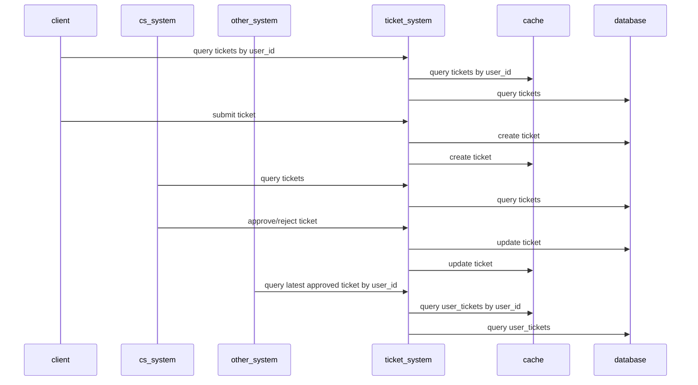

# Ticket system

Ticket system is a system which allows user to submit some kind of action, then system saves it as a ticket. Ticket
later can be approve, reject by people or auto.

Ticket system is very polular in domains which require Customer Service (CS) to help user. For example, to allow user
submit identity infomartion for Electronic Know Your Customer (EKYC).

This servers as a checklist for future me to speed run building a new ticket system from scratch.

## Database

At least has 2 tables:

- Table `tickets`: All tickets go here
- Table `user_tickets`: Only map user with latest **approve** ticket. Because we only care about approve not reject.

### Table `tickets`

Required fields:

| Field           | Explain                              | Index |
| --------------- | ------------------------------------ | ----- |
| `id`            | Primary key, known as `ticket_id`    |       |
| `user_id`       |                                      | x     |
| `status`        | Status approve/reject/processing/... |       |
| `extra`         |                                      |       |
| `created_at_ms` |                                      | x     |
| `updated_at_ms` |                                      | x     |

Also depends on business, need to save:

- Who approve/reject ticket
- Reason why ticket is reject

### Table `user_tickets`

Required fields:

| Field           | Explain                   | Index |
| --------------- | ------------------------- | ----- |
| `user_id`       | Primary key               |       |
| `ticket_id`     | Reference to `tickets.id` | x     |
| `extra`         |                           |       |
| `created_at_ms` |                           | x     |
| `updated_at_ms` |                           | x     |

## Design system

To reduce hit database, use cache layer.

Query tickets can not use cache layer, only database. So we need to improve:

- Limit time range to query
- Use slave database node to query, master to create/update
