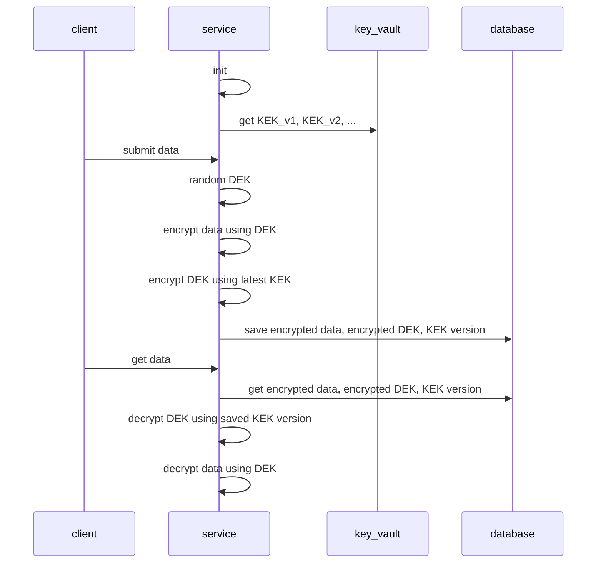

# KEK DEK

KEK is Key Encryption Key. DEK is Data Encryption Key.

Use KEK DEK for database encryption at rest.

KEK is saved in key vault. DEK is **random** for each record.

When rotate key:

- Create new KEK
- New record will use new KEK
- Old record can decrypt using old KEK

Migrate old data:

- Encrypted data is **untouched**
- Query all encrypted DEK with old KEK version, then update only new encrypted DEK and new KEK version
