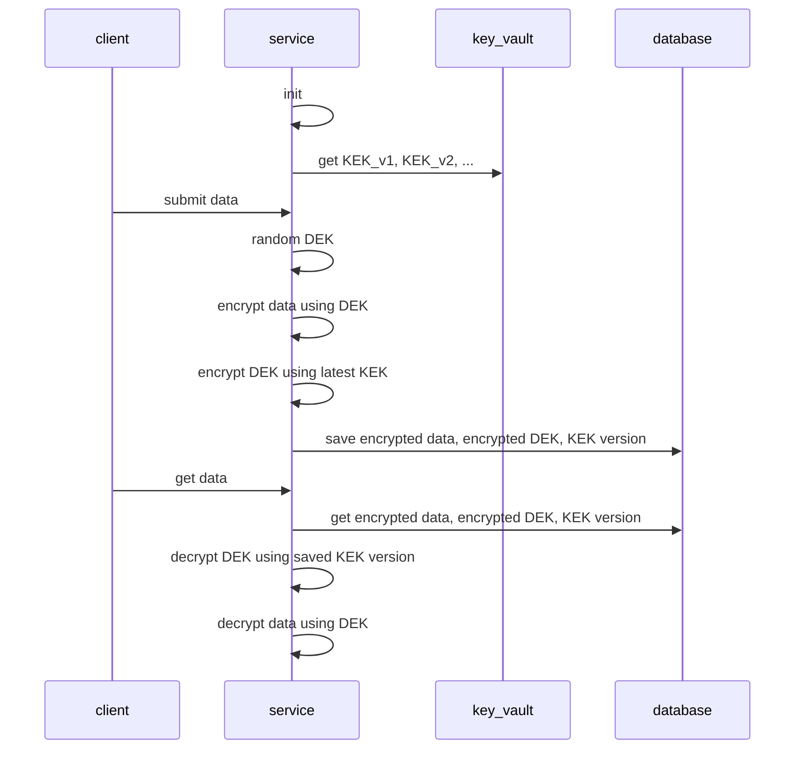
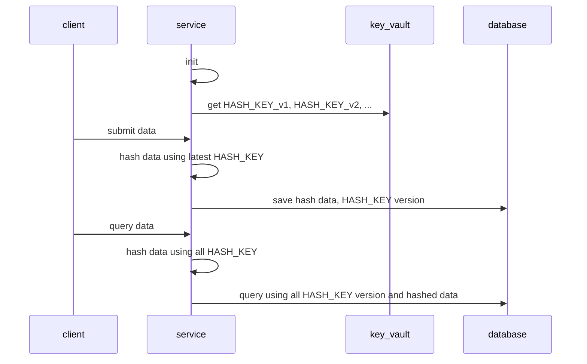

# KEK DEK

KEK is Key Encryption Key. DEK is Data Encryption Key.

Use KEK DEK for database encryption at rest.

- KEK is saved in key vault
- DEK is **random** for each record
    - Do not save DEK directly in database, use KEK to encrypt DEK, then save encrypted DEK instead
    - Use DEK to encrypt data, then save encrypted data in database
    - Save KEK version in database
- Use **AES-256-GCM with AAD** algorithm to encrypt

```mermaid
sequenceDiagram
    participant client
    participant service
    participant key_vault
    participant database

    service ->> service: init
    service ->> key_vault: get KEK_v1, KEK_v2, ...

    client ->> service: submit data
    service ->> service: random DEK
    service ->> service: encrypt data using DEK
    service ->> service: encrypt DEK using latest KEK
    service ->> database: save encrypted data, encrypted DEK, KEK version

    client ->> service: get data
    service ->> database: get encrypted data, encrypted DEK, KEK version
    service ->> service: decrypt DEK using saved KEK version
    service ->> service: decrypt data using DEK
```

When rotate KEK:

- Create new KEK
- New record will use new KEK
- Old record can decrypt using old KEK
- Migrate data with old KEK
    - Encrypted data is **untouched**
    - Query all encrypted DEK with old KEK version, then update only new encrypted DEK and new KEK version

## Query encrypted field

To query encrypted field, we need hash:

- Hash key is saved in key vault, same as KEK
    - Use hash key to hash data, then save hash data in database
    - Save hash key version in database, same as KEK version
- Composite index for column hash key version and hash data `[32]byte`, `BINARY(32)` for MySQL in database
- Use **HMAC-SHA256** algorithm to hash

```mermaid
sequenceDiagram
    participant client
    participant service
    participant key_vault
    participant database

    service ->> service: init
    service ->> key_vault: get HASH_KEY_v1, HASH_KEY_v2, ...

    client ->> service: submit data
    service ->> service: hash data using latest HASH_KEY
    service ->> database: save hash data, HASH_KEY version

    client ->> service: query data
    service ->> service: hash data using all HASH_KEY
    service ->> database: query using all HASH_KEY version and hashed data
```

When rotate HASH_KEY:

- Create new HASH_KEY
- New record will use new HASH_KEY
- Old record can query using old HASH_KEY
- Migrate data with old HASH_KEY
    - Query all data with old HASH_KEY version, decrypt data using KEK DEK, then update new hash data and new HASH_KEY
      version

## References

- [AWS Encryption context](https://docs.aws.amazon.com/kms/latest/developerguide/encrypt_context.html): Add additional
  authenticated data (AAD) into encryption and decryption process in application level.
